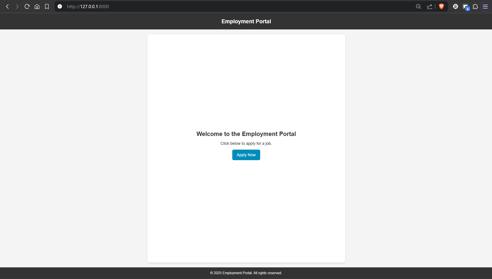
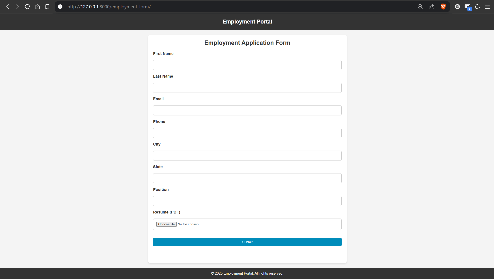
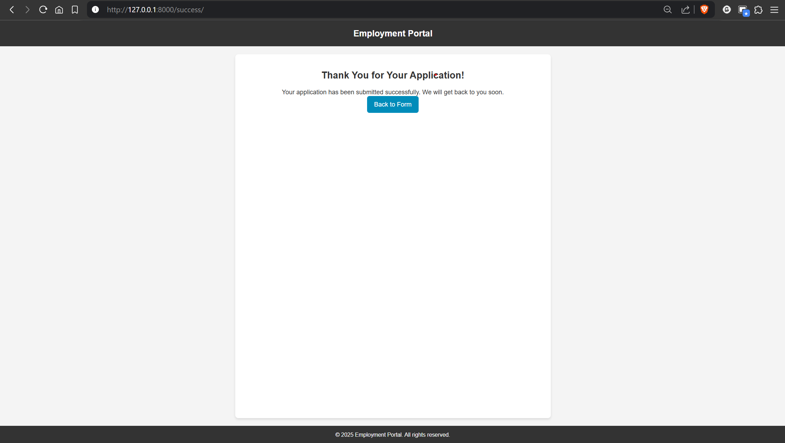

# Employment Portal

A simple Django-based web application designed to collect job applications from candidates. The portal allows users to submit their personal details, resume, and cover letter through an intuitive form. The project follows best practices for security by storing sensitive data like the Django `SECRET_KEY` in `local_settings.py`.

## Features

- User-friendly form for job applicants.
- File upload functionality for resumes.
- Dynamic handling of personal details, address, and cover letter.
- Clean and minimal design with centered content.
- Secure handling of sensitive settings using `local_settings.py`.

## Tech Stack

- **Backend**: Django
- **Frontend**: HTML, CSS
- **Database**: SQLite (can be swapped for other databases)
- **Version Control**: Git

## Installation

### Prerequisites

Before getting started, ensure you have Python 3.x and `pip` installed.

### 1. Clone the repository

Clone the repository to your local machine using the following command:

```bash
git clone https://github.com/your-username/employment-portal.git



